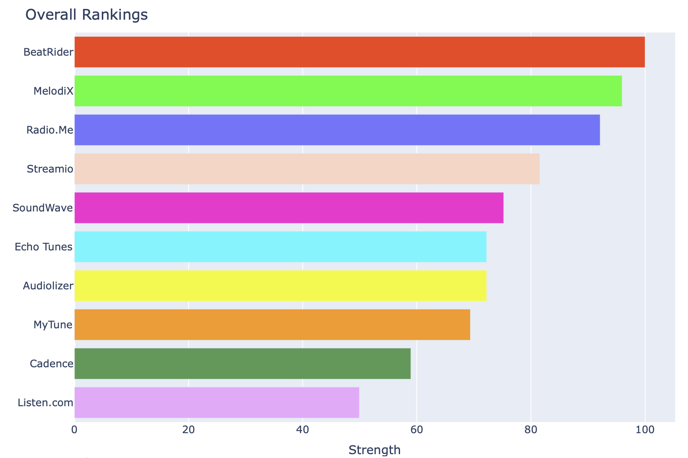

# Text Tournament

Use LLMs to determine the best name, tagline, description, ad copy, etc. for a product or service in minutes! This repo contains a script to run a tournament where all competitors are compared to each other on a set of attributes of your choice.

Use Cases:

- Compare company names on trustworthiness, innovation, ease of memorability, etc.
- Compare taglines on clarity, convincingness, etc.
- Compare product descriptions on informativeness, persuasiveness, etc.

## Example: Naming a Music Service

Here's a full example config that suggests names for a hypothetical Spotify competitor:

```yaml
competitors:
  - "Streamio"
  - "Audiolizer"
  - "Radio.Me"
  - "MyTune"
  - "SoundWave"
  - "BeatRider"
  - "Echo Tunes"
  - "Cadence"
  - "Listen.com"
  - "MelodiX"
attributes:
  - "Pronounceability"
  - "Descriptiveness"
  - "Memorability"
  - "Uniqueness"
  - "Fun"
label: "name ideas for a music service"
out_file: data/audio.csv
model: gpt-4o
threads: 32
```



See the full output here: [analysis.html]()

⚠️ This approach is not a replacement for user testing or human judgement. It beats guessing and helps chow through a large number of options quickly. It's a great way to get a shortlist of competitors to test with real users or to get a sense of what's working and what's not.

## Installation

- Clone the repo
- Install Python 3.10 or later
- Install the required packages with `poetry install`
- Install [Quarto](https://quarto.org/docs/get-started/)
- Set an environment variable `OPENAI_API_KEY` with your OpenAI API key or the equivalent of another LLM provider

## Usage

1. Run the `tournament` script with the options and attributes you want to compare. For example:

```bash
tournament -c Apple -c Microsoft -c Google -a innovation -a trustworthiness --label companies --filepath data/results.csv
```

This compares Apple, Microsoft and Google on innovation and trustworthiness. The results are saved to `data/results.csv`. The number of LLM calls is `n_options * n_attributes * 2`. The example above would run 8 completions.

Argument reference

| Argument          | Description                                                                               | Example                     |
| ----------------- | ----------------------------------------------------------------------------------------- | --------------------------- |
| -c, --competitors | Add a competitor to the tournament. Must set at least 2 and no more than 24 competitors   | -c 'Echo Tunes'             |
| -a, --attributes  | Add an attribute to compare options on. At least one is required.                         | -a innovation               |
| --label           | Label for the tournament, this is given to the model to help it make sense of the options | --label companies           |
| --filepath        | File to save the results to                                                               | --out_file data/results.csv |
| --model           | Name of the model to use                                                                  | --model gpt-4o-mini         |
| --threads         | Number of parallel requests, can be set quite high if API limits allow it                 | --threads 32                |

The arguments can also be supplied in a .yml file. See `example/config.yml` for an example. Then run: `tournament --config example/config.yml`.

1. Render the `analysis.qmd` file with Quarto to see the results. For example:

```bash
quarto render text_tournament/analysis.qmd -P filepath:data/results.csv
```

Note that the filepath must be relative to the location of the `analysis.qmd` file.

View the rendered `analysis.html` file in a browser.
s
3. Check the reasons for the decisions in the `data/results.csv` file.

## Models

By default `gpt-4o-mini` by OpenAI is used. It's a cheap, reasonably smart model. Running 1000 comparisons costs about $0.10. For higher quality results use `gpt-4o`.

You can use another chat model by OpenAI or a [litellm-compatible](https://docs.litellm.ai/docs/providers/) model that has function calling enabled. Set the `--model` argument to the model name and make sure that you have the required API key set in your environment or a `.env` file.

## Background

I'll write a blog post about this. For now, here's a short explanation of how the comparisons are made:

- Each competitor is compared to each other competitor on each attribute twice: once as the first option and once as the second option
- Each matchup is a binary choice for the LLM
- The results are analyzed with a [Bradley-Terry](https://en.wikipedia.org/wiki/Bradley%E2%80%93Terry_model) model to aggregate the results
